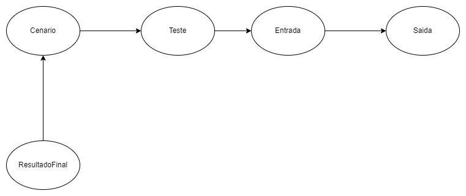

# Laboratorium 

Laboratorium é um aplicativo que permite você gerenciar, mapear e controlar seus cenários de testes, formalizando hipóteses e conclusões acerca dos testes executados.



## Preparando ambiente de execução

Primeiramente, para executar o projeto precisamos ter instalado a seguinte versão do Java JDK `17.0.8` que corresponde ao Java 17.

Clone o projeto Laboratorium para sua maquina

```
git clone git@github.com:drmcarvalho/laboratorium.git
```

Acesse o novo diretório do projeto 

```
cd laboratorium
```

Vamos executar o maven e rodar projeto com o H2Database em memória digitanto o seguinte comando

Em ambientes Windows, execute o seguinte comando
```
mvnw clean spring-boot:run
```

Em ambientes linux, vamos deixar o arquivo `mvnw` executável 
```
$ chmod +x mvnw
```

Em seguida, execute o seguinte comando
```
$ ./mvnw clean spring-boot:run
```

## OpenAPI documentação da API Rest

Para consultar a lista de endpoints acesse `localhost:8080/swagger-ui/index.html`
